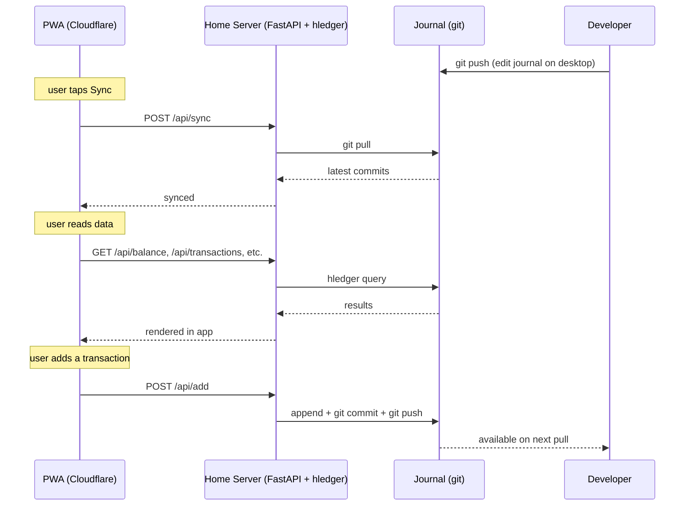

# hledger Mobile

A self-hosted, privacy-first personal finance PWA that puts a mobile interface on top of [hledger](https://hledger.org/) — without any financial data ever leaving your home server.

---

## Overview

hledger is a fast, reliable plain-text accounting tool — and entirely terminal-based. Checking your balance from your phone means either SSHing into a server or maintaining a spreadsheet somewhere. This project solves that by wrapping hledger in a secure API layer and serving a mobile-first PWA through Cloudflare, without any financial data ever leaving the home server.

The Worker injects auth secrets server-side — the browser never sees them. The home server has zero open inbound ports; all traffic arrives through a Cloudflare Tunnel.

See [`docs/architecture.md`](docs/architecture.md) for detailed sequence diagrams.

---

## Features

**Dashboard**
- Year-to-date activity heatmap — tap any day to see that day's transactions
- Profit / loss bar chart (trailing 12 months)
- Spending vs prior period with last-month / 3-month-average toggle
- Net worth trend line

**Envelopes**
- Virtual envelope budgeting layered over hledger (no journal changes required)
- Scan for new unassigned transactions, assign income splits, assign expenses
- Transfer between envelopes, manual adjustments, full history

**Transactions**
- Month picker and full-text search across all transactions
- Tap to expand: postings, comments, raw hledger journal entry

**Reports**
- Balance tree and monthly breakdown in one tab with sub-tab toggle
- Tap any account row to expand this month's transactions inline (both views)

**Privacy toggle**
- Eye icon in the header masks income amounts, net worth, and envelope balances in-memory
- Does not persist — resets on page load
- Charts remain visible (aggregate data, not sensitive)

**Add transaction**
- 7-step guided form: date → description → account → amount → account → amount → preview
- Live autocomplete for account names and descriptions
- Description lookup pre-fills accounts from your most recent matching transaction
- Editable raw preview before submit

**PWA**
- Installable on iOS and Android via "Add to Home Screen"
- Offline support via service worker cache

---

## Stack

| Layer | Technology |
|-------|------------|
| Frontend | React 19, Vite 6, TypeScript, Recharts |
| Edge runtime | Cloudflare Workers + Workers Assets |
| API server | FastAPI + uvicorn (Python) |
| Accounting engine | hledger (plain-text double-entry) |
| Journal storage | `.hledger` file in a git repository |
| Tunnel | Cloudflare Tunnel (cloudflared) |
| Auth | Cloudflare Access (service token) |

---

## Security model

Auth secrets (`BEARER_TOKEN`, `CF-Access-Client-Id`, `CF-Access-Client-Secret`) are stored as Cloudflare Worker secrets. They are injected into API proxy requests server-side — the browser never sees them and they never appear in the client bundle.

The journal file and all raw financial data live only on the home server. The Worker only ever forwards JSON query results, never raw journal content.

---

## Changelog

### v2 — React rewrite (current)

The entire frontend was migrated from a monolithic ~2,400-line vanilla JS/HTML file to a typed React 19 + Vite 6 component tree (~20 files). This was a prerequisite for the features below.

| What changed | Detail |
|---|---|
| Frontend | Vanilla JS → React 19 + TypeScript + Vite 6 |
| Demo mode | Removed entirely (PIN modal, KV namespace, `/api/demo/*` routes) |
| Privacy toggle | Eye icon masks income amounts and balances in-memory |
| Tab layout | 4 tabs: Dashboard, Envelopes, Transactions, Reports |
| Dashboard | YTD heatmap, profit/loss, spending comparison, net worth line |
| Monthly report | Depth-2 by default; tap a row to expand transactions |
| Balance report | Tap any account row to expand this month's transactions |
| Bundle | Workers Assets (static file serving) replaces bundled HTML import |
| XSS protection | React JSX auto-escaping replaces manual `escHtml()` calls |

### v1 — Vanilla JS SPA

- Balance, income statement, monthly, and transactions views
- Add transaction form with account/description autocomplete
- Sync button (git pull + hledger rebuild)
- Demo mode backed by Cloudflare KV
- Envelope budgeting system (scan, assign, transfer, adjust)
- Search across all transactions
- PWA: installable, offline cache via hand-rolled service worker

---

## Docs

- [`docs/architecture.md`](docs/architecture.md) — request flow, auth layers, caching strategy, sequence diagrams
- [`docs/deploy.md`](docs/deploy.md) — setup guide: home server, Cloudflare Tunnel, Access, Worker, local dev
