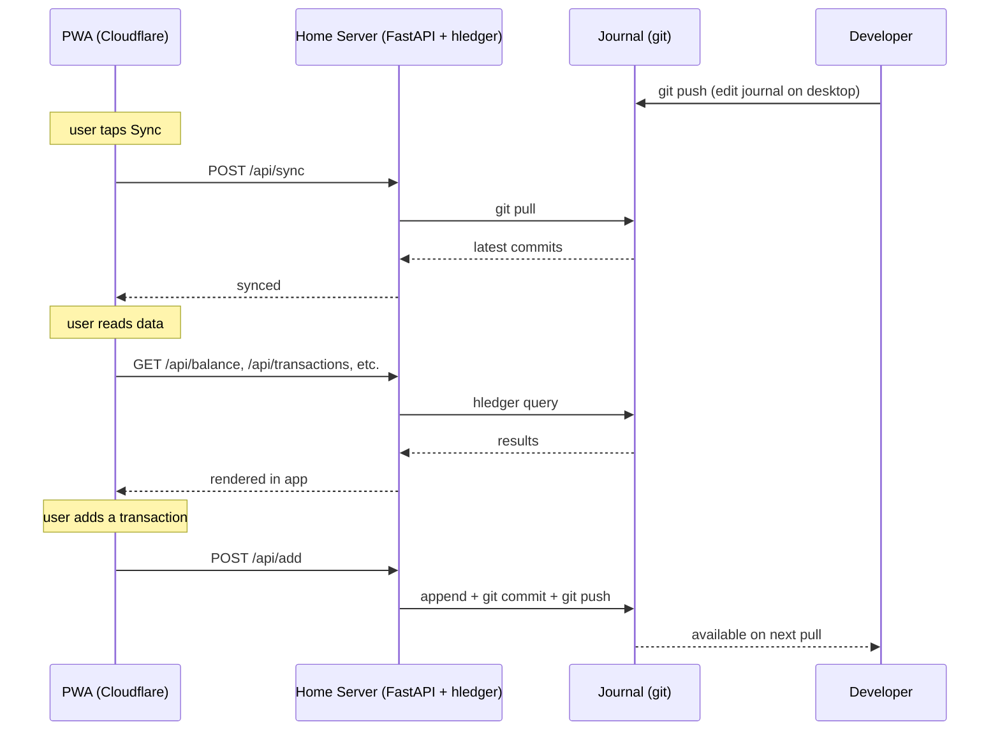

# hledger Mobile

A self-hosted personal finance PWA. It puts a phone-friendly interface on top of
[hledger](https://hledger.org/). No financial data leaves the home server.

---

## Overview

hledger is a fast, reliable plain-text accounting tool. It is also
terminal-only. To check a balance from a phone, you must SSH into a server or
handle duplicate files on your devices.

This project wraps hledger in an API and serves a mobile-first PWA through
Cloudflare. The journal stays in one location on the home server.

```mermaid
sequenceDiagram
    participant App as PWA (Cloudflare)
    participant Server as Home Server (FastAPI + hledger)
    participant Journal as Journal (git)
    participant Dev as Developer

    Dev->>Journal: git push (edit journal on desktop)

    Note over App: user taps Sync
    App->>Server: POST /api/sync
    Server->>Journal: git pull
    Journal-->>Server: latest commits
    Server-->>App: synced

    Note over App: user reads data
    App->>Server: GET /api/balance, /api/transactions, etc.
    Server->>Journal: hledger query
    Journal-->>Server: results
    Server-->>App: rendered in app

    Note over App: user adds a transaction
    App->>Server: POST /api/add
    Server->>Journal: append + git commit + git push
    Journal-->>Dev: available on next pull
```

The Worker adds the auth secrets on the server side. The browser never sees
them. The home server has no open inbound ports. All traffic comes through a
Cloudflare Tunnel.

For the full request flow, see [`docs/architecture.md`](docs/architecture.md).

---

## Features

**Dashboard** - year-to-date activity heatmap, profit/loss bars, spending
against the prior period, and a net worth trend.

**Transactions** — month picker, full-text search with date and category
filters, and a tap-to-expand view with the raw journal entry.

**Reports** — balance tree, monthly breakdown, and the chart of accounts. Tap an
account row to see its transactions.

**Envelopes** — envelope budgeting on top of hledger. The journal format does
not change. See [`docs/envelopes.md`](docs/envelopes.md).

**Transaction inbox** — bank alert emails arrive as pending items with a
suggested entry. You review each one before it reaches the journal. See
[`docs/transaction-inbox.md`](docs/transaction-inbox.md).

**Add transaction** — a guided form with autocomplete. It pre-fills the accounts
from your last matching transaction.

**Privacy toggle** — an eye icon masks income, net worth, and envelope balances.
The mask does not persist. It resets on page load.

**PWA** — installable on iOS and Android. A service worker caches the app for
offline use.

---

## Stack

| Layer | Technology |
|-------|------------|
| Frontend | React 19, Vite 6, TypeScript, Recharts |
| Edge runtime | Cloudflare Workers + Workers Assets |
| API server | FastAPI + uvicorn (Python) |
| Accounting engine | hledger (plain-text double-entry) |
| Journal storage | `.hledger` file in a git repository |
| Tunnel | Cloudflare Tunnel (cloudflared) |
| Auth | Cloudflare Access (service token) |

---

## Security model

The auth secrets (`BEARER_TOKEN`, `CF-Access-Client-Id`,
`CF-Access-Client-Secret`) are Cloudflare Worker secrets. The Worker adds them
to each proxied API request. They are not in the client bundle.

The journal and all raw financial data stay on the home server. The Worker
forwards JSON results only. It never forwards raw journal content.

---

### Project Note

This app is built around my own accounts, my bank's alert emails, my journal
layout, and budgeting style. It is public so that others can take inspiration from it and see the project, not because it
is a product you can install as-is.

If you want to get started with something like this, start with plain [hledger](https://hledger.org/) in a terminal. 

If you want a budgeting app instead, look at
[YNAB](https://www.ynab.com/) or [Actual Budget](https://actualbudget.org/).

---

## Docs

Full documentation is in [`docs/`](docs/README.md):

- [`docs/architecture.md`](docs/architecture.md) — request flow, auth layers, caching, sequence diagrams
- [`docs/deploy.md`](docs/deploy.md) — setup: home server, Cloudflare Tunnel, Access, Worker, local dev
- [`docs/envelopes.md`](docs/envelopes.md) — envelope budgeting: model, reconciliation, scan and assign, API
- [`docs/transaction-inbox.md`](docs/transaction-inbox.md) — capture from bank-alert emails
- [`docs/CHANGELOG.md`](docs/CHANGELOG.md) — what changed in each version
