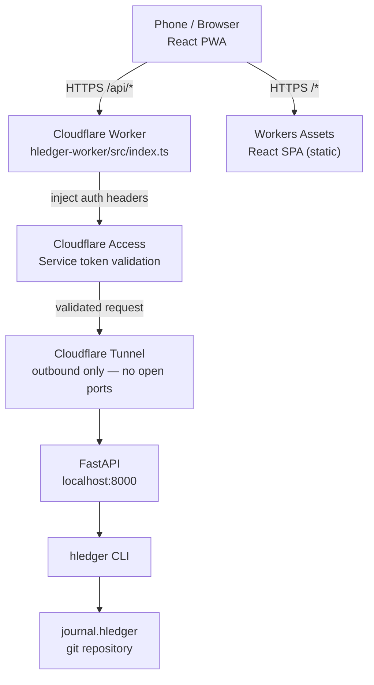
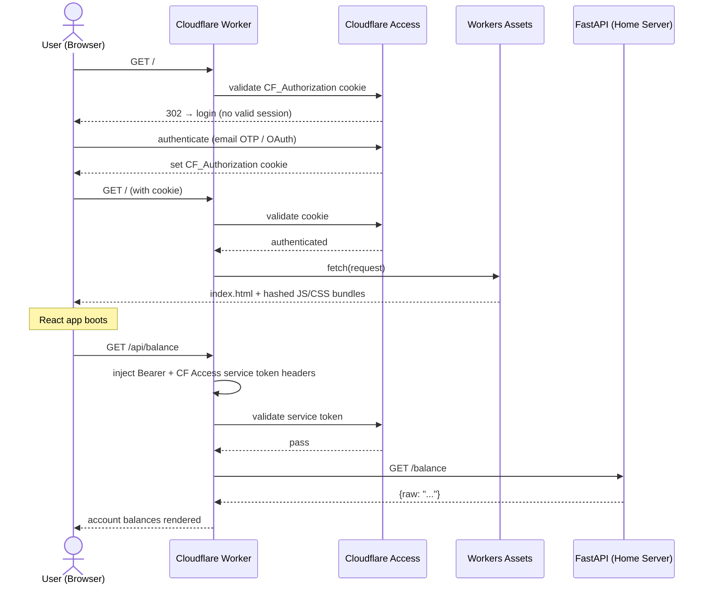
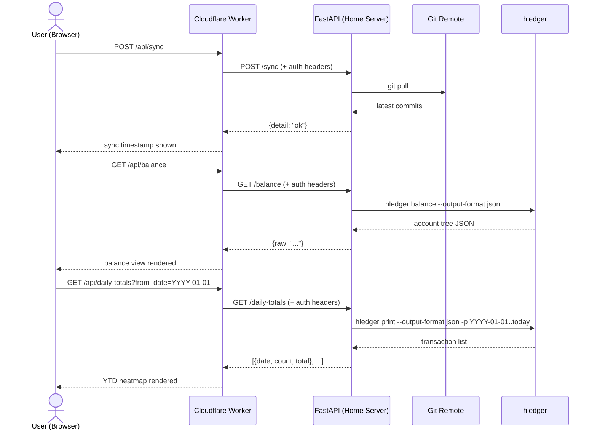
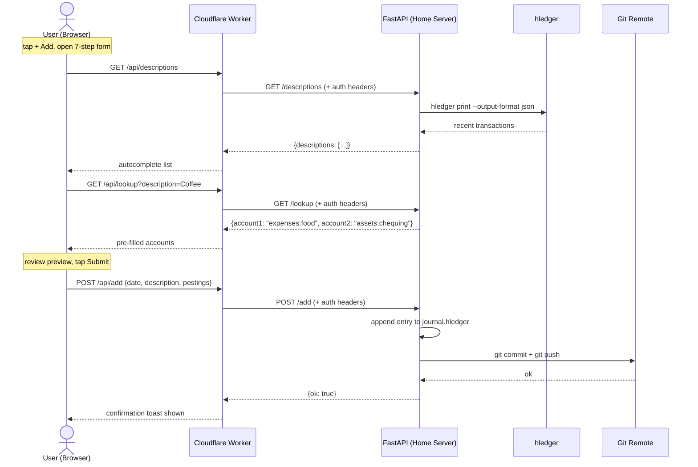
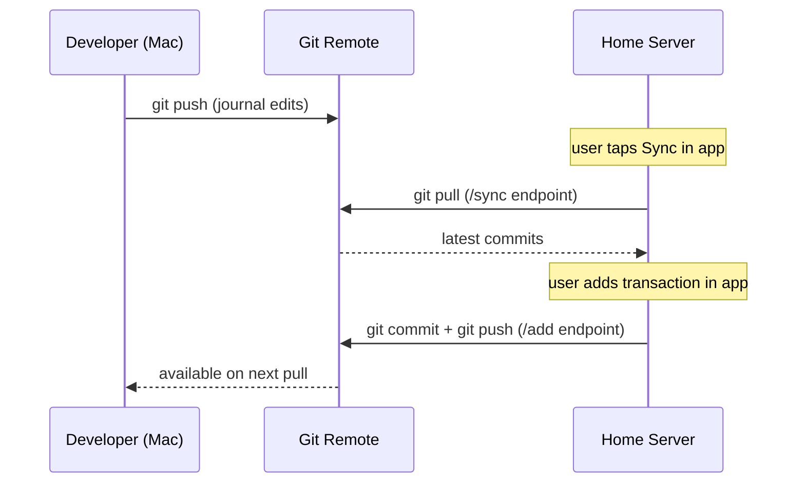

# Architecture

## System Overview



---

## Flow 1 — Authentication & First Load



---

## Flow 2 — Sync & Read



---

## Flow 3 — Add Transaction



---

## Authentication Layers

| Layer | Mechanism | Protects |
|-------|-----------|----------|
| Cloudflare Access | Service token (Client ID + Secret headers) | Blocks requests not originating from the Worker |
| FastAPI Bearer token | `Authorization: Bearer ...` | Second layer if Access is bypassed |

Neither token ever reaches the browser — both are injected by the Worker from its secret store (`wrangler secret put`).

---

## Frontend State

All state lives in `App.tsx` and is prop-drilled. No Redux or Context beyond `PrivacyContext` (an in-memory boolean). At the current scale (~20 components) this is intentional.

### Caching Strategy

| Data | Where cached | TTL |
|------|-------------|-----|
| Balance / Monthly / Transactions | `localStorage` (`hledger_cache`) | Until next sync |
| Envelope data | `localStorage` (`hledger_envelopes_v3`) | Until next sync |
| Last sync time | `localStorage` (`hledger_last_sync`) | Displayed in header |
| Account / description lists | `localStorage` | Until next sync |
| Monthly drilldown transactions | Component state | Until page reload |
| Dashboard heatmap | Component state | Until page reload |

---

## Privacy Toggle

The eye icon in the header toggles `privacyMode` in `PrivacyContext`. Resets on page reload — never persisted.

**Masked** (rendered as `••••` via `<MaskedAmount>`):
- Net worth, assets, liabilities in summary cards
- Envelope balances and totals
- Income transaction amounts (posting account starts with `income`)
- Income row amounts in the Monthly report

**Never masked:**
- Expense amounts
- Account names, dates, descriptions
- Dashboard charts (aggregate trend data)

---

## Journal Git Flow



---

## systemd Services (Home Server)

Two services run permanently:

**FastAPI** (`/etc/systemd/system/hledger-api.service`):
```ini
[Unit]
Description=hledger FastAPI
After=network.target

[Service]
User=<user>
WorkingDirectory=/path/to/hledger-wrapper/api
EnvironmentFile=/path/to/hledger-wrapper/api/.env
ExecStart=/path/to/venv/bin/uvicorn main:app --host 127.0.0.1 --port 8000
Restart=on-failure

[Install]
WantedBy=multi-user.target
```

**Cloudflare Tunnel** — managed by `cloudflared service install` after authenticating.

---

## Build & Deploy

```bash
cd hledger-worker
npm run deploy   # vite build → dist/client/ then wrangler deploy
```

After changing `wrangler.jsonc` bindings: `npm run cf-typegen` to regenerate `worker-configuration.d.ts`.
