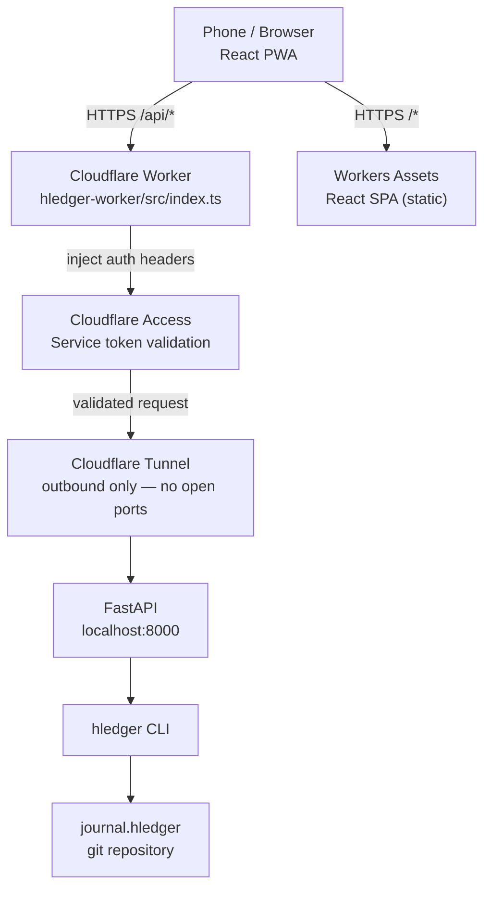
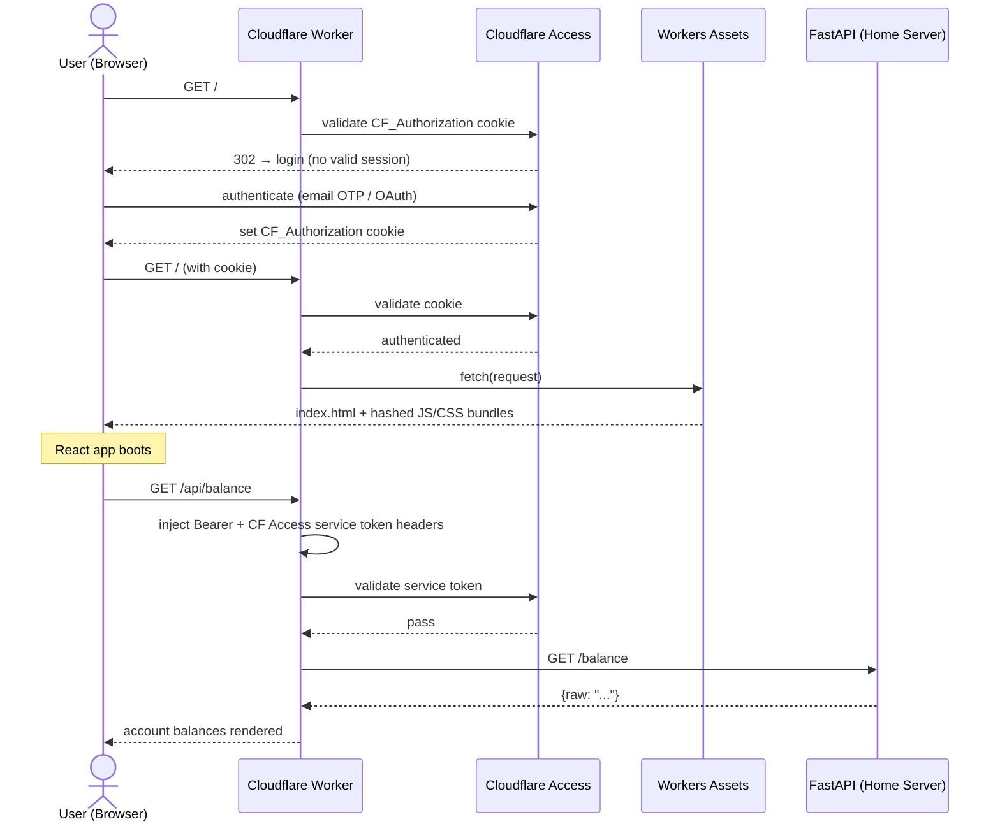
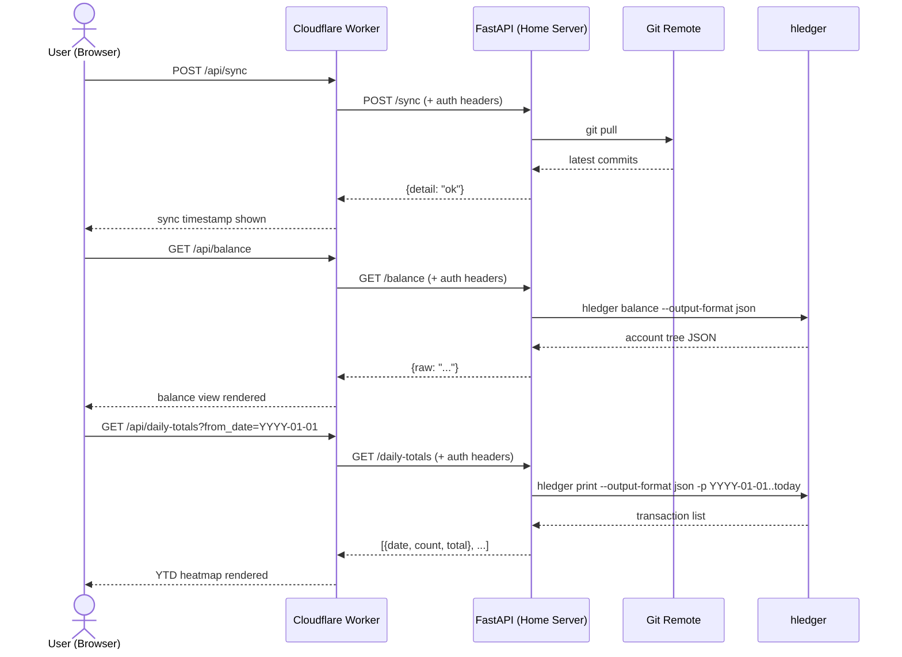
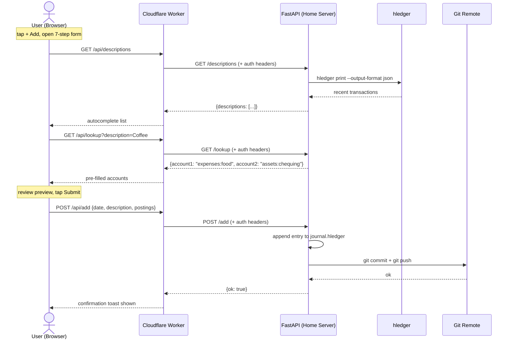
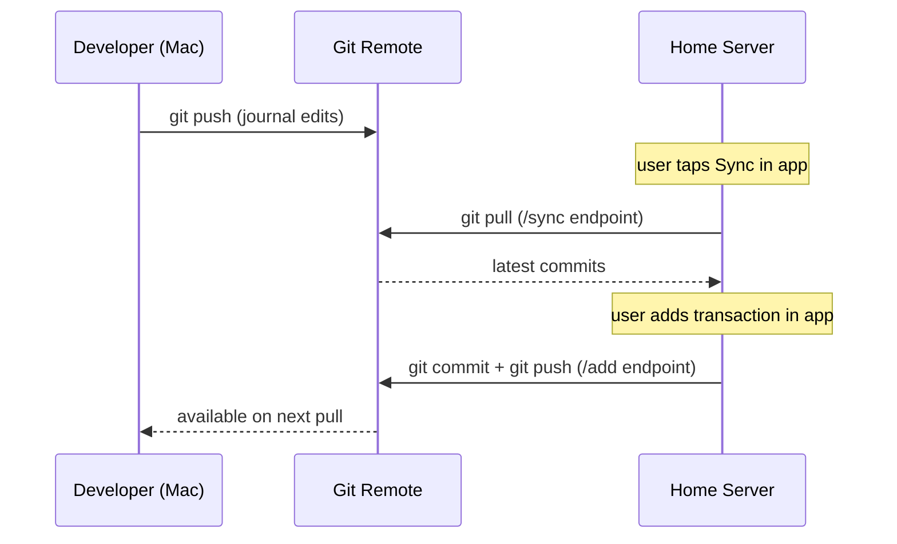

# Architecture

How a request travels from the phone to the journal and back.

## System Overview

The browser talks only to Cloudflare. The Worker adds the auth headers and
passes API requests through the tunnel to the home server. hledger reads the
journal there.


```mermaid
graph TD
    Browser["Phone / Browser\nReact PWA"]
    Worker["Cloudflare Worker\nhledger-worker/src/index.ts"]
    Assets["Workers Assets\nReact SPA (static)"]
    Access["Cloudflare Access\nService token validation"]
    Tunnel["Cloudflare Tunnel\noutbound only — no open ports"]
    FastAPI["FastAPI\nlocalhost:8000"]
    hledger["hledger CLI"]
    Journal["journal.hledger\ngit repository"]

    Browser -->|"HTTPS /api/*"| Worker
    Browser -->|"HTTPS /*"| Assets
    Worker -->|"inject auth headers"| Access
    Access -->|"validated request"| Tunnel
    Tunnel --> FastAPI
    FastAPI --> hledger
    hledger --> Journal
```

---

## Flow 1 — Authentication and First Load

The user logs in through Cloudflare Access. The Worker then serves the app and
proxies the first data request.


```mermaid
sequenceDiagram
    actor User as User (Browser)
    participant W as Cloudflare Worker
    participant Access as Cloudflare Access
    participant Assets as Workers Assets
    participant API as FastAPI (Home Server)

    User->>W: GET /
    W->>Access: validate CF_Authorization cookie
    Access-->>User: 302 → login (no valid session)
    User->>Access: authenticate (email OTP / OAuth)
    Access-->>User: set CF_Authorization cookie

    User->>W: GET / (with cookie)
    W->>Access: validate cookie
    Access-->>W: authenticated
    W->>Assets: fetch(request)
    Assets-->>User: index.html + hashed JS/CSS bundles

    Note over User: React app boots

    User->>W: GET /api/balance
    W->>W: inject Bearer + CF Access service token headers
    W->>Access: validate service token
    Access-->>W: pass
    W->>API: GET /balance
    API-->>W: {raw: "..."}
    W-->>User: account balances rendered
```

---

## Flow 2 — Sync and Read

Sync pulls the journal from git. Each read runs an hledger query against the
pulled journal.


```mermaid
sequenceDiagram
    actor User as User (Browser)
    participant W as Cloudflare Worker
    participant API as FastAPI (Home Server)
    participant Git as Git Remote
    participant H as hledger

    User->>W: POST /api/sync
    W->>API: POST /sync (+ auth headers)
    API->>Git: git pull
    Git-->>API: latest commits
    API-->>W: {detail: "ok"}
    W-->>User: sync timestamp shown

    User->>W: GET /api/balance
    W->>API: GET /balance (+ auth headers)
    API->>H: hledger balance --output-format json
    H-->>API: account tree JSON
    API-->>W: {raw: "..."}
    W-->>User: balance view rendered

    User->>W: GET /api/daily-totals?from_date=YYYY-01-01
    W->>API: GET /daily-totals (+ auth headers)
    API->>H: hledger print --output-format json -p YYYY-01-01..today
    H-->>API: transaction list
    API-->>W: [{date, count, total}, ...]
    W-->>User: YTD heatmap rendered
```

---

## Flow 3 — Add Transaction

The form fetches its autocomplete data first. On submit, the server appends the
entry to the journal and pushes it.


```mermaid
sequenceDiagram
    actor User as User (Browser)
    participant W as Cloudflare Worker
    participant API as FastAPI (Home Server)
    participant H as hledger
    participant Git as Git Remote

    Note over User: tap + Add, open 7-step form

    User->>W: GET /api/descriptions
    W->>API: GET /descriptions (+ auth headers)
    API->>H: hledger print --output-format json
    H-->>API: recent transactions
    API-->>W: {descriptions: [...]}
    W-->>User: autocomplete list

    User->>W: GET /api/lookup?description=Coffee
    W->>API: GET /lookup (+ auth headers)
    API-->>W: {account1: "expenses:food", account2: "assets:chequing"}
    W-->>User: pre-filled accounts

    Note over User: review preview, tap Submit

    User->>W: POST /api/add {date, description, postings}
    W->>API: POST /add (+ auth headers)
    API->>API: append entry to journal.hledger
    API->>Git: git commit + git push
    Git-->>API: ok
    API-->>W: {ok: true}
    W-->>User: confirmation toast shown
```

---

## Authentication Layers

Two independent checks guard the API.

| Layer | Mechanism | Protects |
|-------|-----------|----------|
| Cloudflare Access | Service token (Client ID + Secret headers) | Blocks requests that do not come from the Worker |
| FastAPI Bearer token | `Authorization: Bearer ...` | Second layer if Access is bypassed |

Neither token reaches the browser. The Worker reads both from its secret store
(`wrangler secret put`) and adds them to each proxied request.

---

## Frontend State

All state lives in `App.tsx` and is passed down as props. There is no Redux and
no Context other than `PrivacyContext`, which holds one boolean in memory. At
the present size of about 20 components, this is a deliberate choice.

### Caching Strategy

The app shows cached data first, then refreshes it.

| Data | Where cached | TTL |
|------|-------------|-----|
| Balance / Monthly / Transactions | `localStorage` (`hledger_cache`) | Until next sync |
| Envelope data | `localStorage` (`hledger_envelopes_v3`) | Until next sync |
| Last sync time | `localStorage` (`hledger_last_sync`) | Displayed in header |
| Account / description lists | `localStorage` | Until next sync |
| Monthly drilldown transactions | Component state | Until page reload |
| Dashboard heatmap | Component state | Until page reload |

---

## Privacy Toggle

The eye icon in the header sets `privacyMode` in `PrivacyContext`. The setting
is never written to storage, so a page reload clears it.

`<MaskedAmount>` shows these values as `••••`:

- Net worth, assets, and liabilities in the summary cards
- Envelope balances and totals
- Income transaction amounts, where the posting account starts with `income`
- Income row amounts in the Monthly report

These stay visible:

- Expense amounts
- Account names, dates, and descriptions
- Dashboard charts, which show aggregate trends only

---

## Journal Git Flow

Git is the transport between the desktop and the server. Both sides edit the
same repository.


```mermaid
sequenceDiagram
    participant Dev as Developer (Mac)
    participant Remote as Git Remote
    participant Server as Home Server

    Dev->>Remote: git push (journal edits)
    Note over Server: user taps Sync in app
    Server->>Remote: git pull (/sync endpoint)
    Remote-->>Server: latest commits

    Note over Server: user adds transaction in app
    Server->>Remote: git commit + git push (/add endpoint)
    Remote-->>Dev: available on next pull
```

---

## systemd Services (Home Server)

Two services run continuously.

**FastAPI** (`/etc/systemd/system/hledger-api.service`):

```ini
[Unit]
Description=hledger FastAPI
After=network.target

[Service]
User=<user>
WorkingDirectory=/path/to/hledger-wrapper/api
EnvironmentFile=/path/to/hledger-wrapper/api/.env
ExecStart=/path/to/venv/bin/uvicorn main:app --host 127.0.0.1 --port 8000
Restart=on-failure

[Install]
WantedBy=multi-user.target
```

**Cloudflare Tunnel** — install it with `cloudflared service install` after you
authenticate.

---

## Build and Deploy

```bash
cd hledger-worker
npm run deploy   # vite build → dist/client/ then wrangler deploy
```

If you change the bindings in `wrangler.jsonc`, run `npm run cf-typegen` to
regenerate `worker-configuration.d.ts`.

For the full setup procedure, see [deploy.md](deploy.md).
