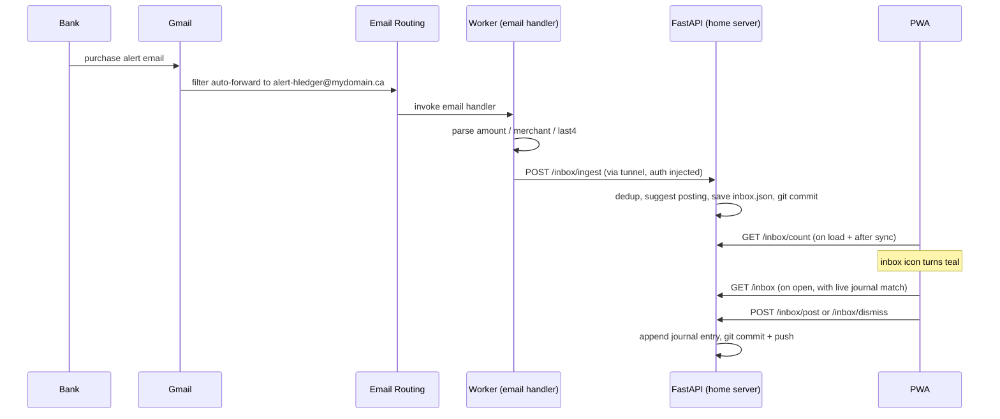

# Transaction Inbox

Semi-automated transaction capture. Every credit card purchase triggers an
alert email; the alert is forwarded into a Cloudflare Worker, parsed, and
staged as a pending item with a pre-written journal entry. Nothing reaches the
journal without an explicit tap in the app — the feature removes the typing,
not the review.

## End-to-End Flow



Key properties:

- Push, not polling — the item exists seconds after the alert email lands.
- The Worker reuses the same injected auth (bearer token + CF Access service
  token) as the `/api/*` proxy. There is no bypass rule and no extra secret.
- Gmail keeps the original alert, so the email pipeline failing never loses
  a transaction.

## Email Handling Rules

The Worker's `email` handler (in `src/index.ts`) triages inbound mail by the
original `From` header (Gmail's filter forwarding preserves it):

| Sender | Action |
|--------|--------|
| `*@creditcardcompany.com` / `*@creditcardcompany.ca` | Parse and ingest |
| `*@google.com` | Forward to the personal Gmail (this is Gmail's one-time forwarding-confirmation email) |
| The owner's own Gmail address | Treated as a manual forward: unwrap the `Forwarded message` block, identify the bank from the embedded `From:` line, use the embedded `Date:` as the transaction date |
| Anything else | Dropped silently (the address will leak eventually) |

The manual-forward path is how you test and how you backfill: forward any old
bank alert from Gmail to `txn-alerts@` and it goes through the normal
pipeline, dated by the original alert's date.

Alerts are never forwarded back to Gmail — the original is already there, and
forwarding back would re-trigger the Gmail filter and loop.

If the bank changes their email template and the parser regex stops matching, the
item still arrives, marked unparsed: it shows the raw subject line, gets low
confidence, and you fill in the entry via Edit. Breakage is visible in the
app, never silent.

## The Suggestion Engine

Every ingested item gets a stored suggestion: a complete two-posting journal
entry. The two sides are chosen independently.

### account2 — the funding side (which card)

Looked up from `card_map` in `inbox.json` using the card's last four digits
from the alert:

```json
"card_map": {
  "1234": "liabilities:cc:mastercard"
}
```

If the last4 is not in the map, the account falls back to
`liabilities:cc:unknown` and the whole suggestion is forced to low confidence
regardless of how well the merchant matched. Fix is a one-line addition to
`card_map`.

### account1 — the expense side (which category)

Three tiers, first match wins:

1. **Merchant rules** (`merchant_rules` in `inbox.json`). Each rule is a
   substring pattern tested case-insensitively against the raw merchant
   string from the email:

   ```json
   "merchant_rules": [
     { "pattern": "SAMOSA", "account": "expenses:food:diningout", "description": "The Samosa Factory" }
   ]
   ```

   Rules always beat history. They come from two places: the "Remember
   merchant" checkbox on the review screen (saves the posted title and
   category as a rule for that merchant), or hand-editing `inbox.json` —
   useful for pre-seeding a merchant before its first transaction or for
   patterns finer than the cleaned descriptor (e.g. a `COSTCO GAS` rule
   above a general `COSTCO` rule; earlier rules in the list win).

2. **History match.** The merchant descriptor is first cleaned — processor
   prefixes stripped (`TST-`, `SQ *`, `PAYPAL *`, ...), trailing store
   numbers dropped (`STARBUCKS #1234` → `STARBUCKS`) — then compared against
   every past transaction description in the journal:
   - **Exact match** (case-insensitive): cleaned merchant equals a past
     description. Takes the most recent such transaction.
   - **Token match**: both strings are broken into alphanumeric tokens of 3+
     characters, and past descriptions sharing at least half of the
     merchant's tokens qualify; the best-overlapping one wins. Example:
     cleaned merchant `The Samosa Factory` (tokens: the, samosa, factory)
     token-matches a past entry `Samosa Factory Lunch`.

   Either way, the suggested category is the matched transaction's first
   `expenses:*` posting account, and the suggested description is the
   historical description, not the raw merchant string. That keeps naming
   consistent in the journal — and because the posted entry becomes history
   itself, the next alert from that merchant exact-matches. The engine
   improves just by being used.

3. **Fallback.** No rule, no history: category is `expenses:uncategorized`
   and the description is the cleaned merchant string. You are expected to
   hit Edit.

### Confidence levels

The chip shown in the inbox list and review screen:

| Level | Meaning | When it happens |
|-------|---------|-----------------|
| High | Post without much scrutiny | A merchant rule matched, or history matched exactly — and the card is in `card_map` |
| Medium | Read before posting | History matched on token overlap (right merchant family, but fuzzier) — and the card is known |
| Low | Expect to edit | No match at all (`expenses:uncategorized`), unknown card last4, or an unparsed alert |

`matched_on` in the API response records which tier fired (`rule`,
`history:exact`, `history:tokens`, `fallback`) and is shown on the review
screen next to the confidence.

Suggestions are computed once, at ingest, and stored — what you see when the
icon turns teal is exactly what you review later. The one thing computed live
is the journal match, below.

## Dedup and the "Already in Journal" Check

Three layers prevent double entry:

1. **Message ID** — `inbox.json` keeps the last 200 seen email message IDs;
   a redelivered or re-forwarded email is ignored.
2. **Pending items** — same amount + same card last4 within 2 days of an
   existing pending item is treated as a duplicate alert.
3. **The journal itself** — at ingest, if a journal transaction already has
   the same amount within 2 days of the alert date, the item is suppressed
   (`{"status": "duplicate", "reason": "journal"}`). This is why forwarding
   an old alert for an already-recorded purchase produces nothing.

The journal check also runs live every time the inbox is opened: if you
entered the transaction manually (e.g. from the Mac) after the item was
ingested, the item gets a teal "Possibly already in journal" banner showing
the matching entry, with Dismiss as the expected action. It flags rather than
auto-deletes because two same-priced purchases on adjacent days are real.

## The App

- Header inbox icon: teal when pending items exist, default gray otherwise.
  No dot, no count. Count is fetched on app load and after every sync.
- List level: merchant, date, card, amount, and either a confidence chip or
  an "In journal?" chip per item, newest first.
- Review level: parsed alert details, the journal-match banner when
  applicable, then the posting form:
  - **Title** — the transaction description, prefilled with the suggestion.
    When the suggestion did not come from a merchant rule, the field is
    auto-focused with the text selected so typing immediately replaces the
    bank's version with your own. The raw bank descriptor is not lost: it is
    automatically appended as an inline `;` comment whenever it differs from
    the title.
  - **Note** — optional free text, joined into the same inline comment
    (e.g. `; on drive home · MCDONALD'S #40123`).
  - **Category** — shown only when confidence is low or medium (i.e. the
    category is a guess). Prefilled with the suggested account, with
    chart-of-accounts autocomplete: each space-separated token matches as a
    substring (`food din` → `expenses:food:diningout`), `expenses:*` accounts
    listed first. High-confidence items skip the field — the category came
    from a rule or an exact history match; use Edit for the rare override.
  - **Remember merchant** — checkbox; posting also saves a merchant rule
    (pattern = the cleaned bank descriptor, title and category = whatever
    was posted), so the next alert from this merchant arrives at high
    confidence with your title. Works from the edited-entry path too.
  - **Post to journal** — appends the entry built from the fields above,
    commits, pushes.
  - **Edit accounts / amounts** — swaps the form for the raw editable entry
    (same format as the add flow) for changes beyond title and note; Post
    then sends the edited text verbatim.
  - **Dismiss** — deletes the item. Nothing touches the journal, and there
    is no trail; dismissed means gone.

Posting or dismissing reloads app data, so balances and the transactions list
reflect the change immediately.

## Storage

`inbox.json` lives in the journal repo (path set by `INBOX_DATA_FILE` in the
server `.env`) and is committed and pushed on every mutation, like
`envelopes.json`. Only pending items are stored — post and dismiss both
delete the item, with the journal's git history serving as the audit trail
for posted entries. Posting commits the journal append and the inbox removal
together in one commit tagged `Source: hledger-mobile-api`.

The file also holds the two hand-maintained config pieces: `card_map` and
`merchant_rules` (see above), plus the `seen_message_ids` dedup ledger.

## API Reference

All bearer-authenticated, served by FastAPI, reached through the Worker proxy
as `/api/inbox/...`:

| Path | Method | Description |
|------|--------|-------------|
| `/inbox/ingest` | POST | Called by the Worker email handler. Dedupes, suggests, stores. |
| `/inbox` | GET | Pending items with stored suggestions plus live `journal_match` |
| `/inbox/count` | GET | `{pending: n}` — cheap poll for the header icon |
| `/inbox/post` | POST | `{id}` posts the suggestion; `{id, raw_entry}` posts the edited text |
| `/inbox/dismiss` | POST | `{id}` — delete without posting |
| `/inbox/rule` | POST | `{pattern, account, description}` — save/replace a merchant rule ("Remember merchant") |

Ingest hard limits: 200 pending items max, amount bounds, string length caps.
A leaked alert address can at worst create junk pending items that are one
tap to dismiss; it can never write to the journal.

## Troubleshooting

- **Alert in Gmail, nothing in inbox**: check Email Routing activity logs,
  then `wrangler tail hledger-worker`. If the item was suppressed as
  `reason: journal`, that is dedup, not failure.
- **Item shows the subject line and low confidence**: the bank's email
  template changed; update the parser regex in `src/index.ts`
  (`BANK_PARSERS`). The item is still fully usable via Edit meanwhile.
- **Ingest delivery failures in the Email Routing log**: home server or
  tunnel down. The alert is still in Gmail; re-forward it manually once the
  server is back.
- **Icon never turns teal**: `/api/inbox/count` returns 503 if
  `INBOX_DATA_FILE` is missing from the server `.env`.

## Known Limitations / Future Ideas

- Only purchase alerts are parsed; refund/credit alert formats have not been
  seen yet and would arrive unparsed.
- Alert amounts are authorizations: tips and gas settle differently, and the
  settled amount appears as a separate item (dismiss the stale one).
- Dismiss is instant and permanent; an app-wide undo is a separate future
  project.
