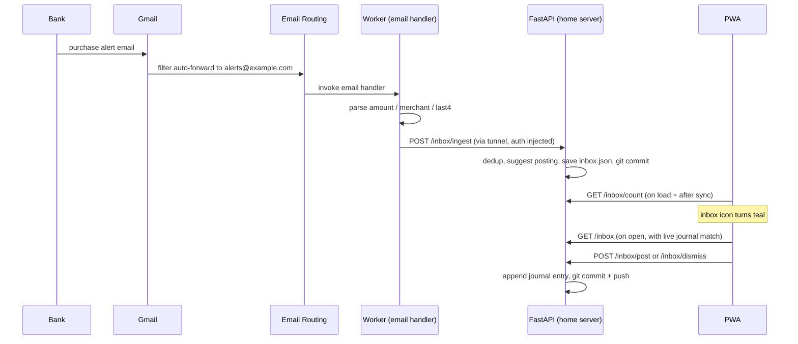

# Transaction Inbox

Semi-automated transaction capture. Each credit card purchase produces an alert
email. The alert is forwarded to a Cloudflare Worker, parsed, and staged as a
pending item with a complete journal entry already written. Nothing reaches the
journal until you tap Post in the app. The feature removes the typing, not the
review.

## End-to-End Flow


```mermaid
sequenceDiagram
    participant Bank as Bank
    participant Gmail
    participant CF as Email Routing
    participant W as Worker (email handler)
    participant API as FastAPI (home server)
    participant App as PWA

    Bank->>Gmail: purchase alert email
    Gmail->>CF: filter auto-forward to alerts@example.com
    CF->>W: invoke email handler
    W->>W: parse amount / merchant / last4
    W->>API: POST /inbox/ingest (via tunnel, auth injected)
    API->>API: dedup, suggest posting, save inbox.json, git commit
    App->>API: GET /inbox/count (on load + after sync)
    Note over App: inbox icon turns teal
    App->>API: GET /inbox (on open, with live journal match)
    App->>API: POST /inbox/post or /inbox/dismiss
    API->>API: append journal entry, git commit + push
```

Three properties matter here:

- The pipeline pushes, it does not poll. The item exists seconds after the
  alert email arrives.
- The Worker uses the same injected auth as the `/api/*` proxy: the bearer token
  and the Cloudflare Access service token. There is no bypass rule and no extra
  secret.
- Gmail keeps the original alert. If the pipeline fails, no transaction is lost.

## Email Handling Rules

The `email` handler in `src/index.ts` sorts inbound mail by the original `From`
header, which Gmail preserves when it forwards.

| Sender | Action |
|--------|--------|
| `*@creditcardcompany.com` / `*@creditcardcompany.ca` | Parse and ingest |
| `*@google.com` | Forward to the personal Gmail. This is Gmail's one-time forwarding-confirmation email. |
| The owner's own Gmail address | Treat as a manual forward: unwrap the `Forwarded message` block, identify the bank from the embedded `From:` line, and use the embedded `Date:` as the transaction date |
| Anything else | Drop without a reply, because the address will leak eventually |

The manual-forward path is how you test the pipeline and how you add old
transactions. Forward any old bank alert from Gmail to `txn-alerts@`. It goes
through the normal pipeline and keeps the date of the original alert.

The handler never forwards an alert back to Gmail. The original is already
there, and a forward would trigger the Gmail filter again and cause a loop.

If the bank changes its email template and the parser no longer matches, the
item still arrives. It is marked as unparsed, shows the raw subject line, and
gets low confidence. You then complete the entry with Edit. A broken parser is
thus visible in the app, never silent.

## The Suggestion Engine

Each ingested item carries a stored suggestion, which is a complete journal
entry of two postings. The engine chooses the two sides independently.

### account2 — the funding side (which card)

The server reads the last four digits of the card from the alert and looks them
up in `card_map` in `inbox.json`:

```json
"card_map": {
  "1234": "liabilities:cc:card"
}
```

If those digits are not in the map, the account becomes
`liabilities:cc:unknown`, and the whole suggestion drops to low confidence, no
matter how well the merchant matched. The fix is one more line in `card_map`.

### account1 — the expense side (which category)

There are three tiers. The first match wins.

1. **Merchant rules**, from `merchant_rules` in `inbox.json`. Each rule holds a
   substring pattern, which the server tests against the raw merchant string
   without regard to case:

   ```json
   "merchant_rules": [
     { "pattern": "COFFEE", "account": "expenses:food:diningout", "description": "Corner Coffee" }
   ]
   ```

   Rules always beat history. They come from two places: the "Remember merchant"
   checkbox on the review screen, which saves the posted title and category as a
   rule, or a manual edit of `inbox.json`. Edit the file by hand to add a
   merchant before its first transaction, or to write a pattern finer than the
   cleaned descriptor. For example, put a `MEGAMART GAS` rule above a general
   `MEGAMART` rule, because the earlier rule in the list wins.

2. **History match.** The server first cleans the merchant descriptor. It
   removes processor prefixes such as `TST-`, `SQ *`, and `PAYPAL *`, and it
   drops trailing store numbers, so `CAFE #1234` becomes `CAFE`. It then
   compares the result with every past description in the journal:
   - **Exact match**, without regard to case: the cleaned merchant equals a past
     description. The server takes the most recent of those transactions.
   - **Token match**: the server breaks both strings into alphanumeric tokens of
     three or more characters. A past description qualifies if it shares at
     least half of the merchant's tokens, and the best overlap wins. The cleaned
     merchant `Corner Coffee`, with the tokens corner and coffee, thus matches a
     past entry `Corner Coffee Downtown`.

   In both cases the suggested category is the first `expenses:*` posting of the
   matched transaction, and the suggested description is the historical
   description rather than the raw merchant string. Naming in the journal stays
   consistent as a result. The posted entry then becomes history itself, so the
   next alert from that merchant matches exactly. The engine improves as you
   use it.

3. **Fallback.** With no rule and no history, the category is
   `expenses:uncategorized` and the description is the cleaned merchant string.
   Expect to tap Edit.

### Confidence levels

The inbox list and the review screen show one of three chips.

| Level | Meaning | When it happens |
|-------|---------|-----------------|
| High | Post without much scrutiny | A merchant rule matched, or history matched exactly, and the card is in `card_map` |
| Medium | Read before you post | History matched on token overlap, so the merchant family is right but the match is looser, and the card is known |
| Low | Expect to edit | No match at all (`expenses:uncategorized`), an unknown card, or an unparsed alert |

The `matched_on` field in the API response records which tier fired: `rule`,
`history:exact`, `history:tokens`, or `fallback`. The review screen shows it
next to the confidence.

Suggestions are calculated once, at ingest, and then stored. What you see when
the icon turns teal is exactly what you review later. Only the journal match,
described next, is calculated live.

## Dedup and the Journal Check

Three layers prevent a double entry.

1. **Message id** — `inbox.json` keeps the last 200 message ids. The handler
   ignores an email that is redelivered or forwarded twice.
2. **Pending items** — the same amount and the same card, within two days of an
   existing pending item, counts as a duplicate alert.
3. **The journal** — at ingest, if a journal transaction already has the same
   amount within two days of the alert date, the server suppresses the item and
   returns `{"status": "duplicate", "reason": "journal"}`. This is why a
   forwarded alert for a purchase you already recorded produces nothing.

The journal check also runs each time you open the inbox. If you entered the
transaction by hand after the item was ingested, the item shows a teal
"Possibly already in journal" banner with the matching entry, and Dismiss is the
expected action. The app flags the item instead of deleting it, because two
purchases of the same price on adjacent days do happen.

## The App

- The inbox icon in the header is teal when items are pending, and gray
  otherwise. There is no dot and no count. The app fetches the count on load and
  after each sync.
- The list shows merchant, date, card, and amount for each item, newest first,
  with either a confidence chip or an "In journal?" chip.
- The review screen shows the parsed alert, the journal-match banner where it
  applies, and then the posting form:
  - **Title** — the description of the transaction, filled from the suggestion.
    If the suggestion did not come from a merchant rule, the field is focused
    with its text selected, so that your first keystroke replaces the bank's
    version. The raw bank descriptor is not lost. The app appends it as an
    inline `;` comment whenever it differs from the title.
  - **Note** — optional free text, added to the same inline comment, for example
    `; on drive home · CAFE #40123`.
  - **Category** — shown only at low or medium confidence, where the category is
    a guess. It is filled with the suggested account and has chart-of-accounts
    autocomplete: each space-separated token matches as a substring, so
    `food din` finds `expenses:food:diningout`, and `expenses:*` accounts come
    first. High-confidence items do not show the field, because the category
    came from a rule or an exact match. Use Edit for the rare override.
  - **Remember merchant** — a checkbox. Posting also saves a merchant rule,
    where the pattern is the cleaned bank descriptor and the title and category
    are the ones you posted. The next alert from that merchant then arrives at
    high confidence with your title. This also works from the edit path.
  - **Post to journal** — appends the entry built from the fields above, then
    commits and pushes.
  - **Edit accounts / amounts** — replaces the form with the raw entry, in the
    same format as the add flow, for changes beyond the title and the note. Post
    then sends your text unchanged.
  - **Dismiss** — deletes the item. Nothing touches the journal, and there is no
    trail. Dismissed means gone.

Post and dismiss both reload the app data, so the balances and the transaction
list show the change at once.

## Storage

`inbox.json` lives in the journal repository, at the path set by
`INBOX_DATA_FILE` in the server `.env`. Once you use folder-based journals, the
server resolves the path from the journal folder instead. It commits and pushes
the file on every change, as it does with `envelopes.json`. Only pending items
are stored, because post and dismiss both delete the item. For posted entries,
the git history of the journal is the audit trail. Posting writes the journal
append and the inbox removal in one commit, tagged `Source: hledger-mobile-api`.

### Ingest target and viewing target

`/inbox/ingest` takes its target journal from a separate `inbox_journal`
pointer, which you set in Settings → Config → "Inbox / email journal". No other
route does this. `/inbox`, `/inbox/count`, `/inbox/post`, `/inbox/dismiss`, and
`/inbox/rule` all use the active journal, because you review and post an item in
the journal you are looking at. Four consequences follow:

- Browsing the demo journal, or any other journal, never redirects real bank
  alerts. They always go to `inbox_journal`, which you set once and then leave.
- The demo journal can never be the ingest target. The rule is structural, not a
  check you can forget.
- If `inbox_journal` is not set, and folder-based journals exist to choose from,
  ingest rejects the alert instead of guessing a target. The Worker already
  absorbs ingest failures, which prevents SMTP retry storms, so the alert is not
  lost. It stays in Gmail until you set an inbox journal and forward it again.
- To review an item that was ingested into a journal you are not viewing, switch
  the active journal to that journal first.

The file also holds the two settings you maintain by hand, `card_map` and
`merchant_rules`, and the `seen_message_ids` list used for dedup.

## API Reference

All endpoints use bearer authentication, are served by FastAPI, and are reached
through the Worker proxy as `/api/inbox/...`.

| Path | Method | Description |
|------|--------|-------------|
| `/inbox/ingest` | POST | Called by the Worker email handler. Dedupes, suggests, stores — targets `inbox_journal`, independent of the active journal. |
| `/inbox` | GET | Pending items with stored suggestions plus live `journal_match` |
| `/inbox/count` | GET | `{pending: n, active_journal: name}` — cheap poll for the header icon, doubles as the multi-device reconcile signal |
| `/inbox/post` | POST | `{id}` posts the suggestion; `{id, raw_entry}` posts the edited text |
| `/inbox/dismiss` | POST | `{id}` — delete without posting |
| `/inbox/rule` | POST | `{pattern, account, description}` — save or replace a merchant rule |

Ingest enforces hard limits: 200 pending items, amount bounds, and string length
caps. If the alert address leaks, the worst result is junk pending items, and
each one is one tap to dismiss. It can never write to the journal.

## Troubleshooting

- **The alert is in Gmail, but nothing is in the inbox.** Check the Email
  Routing activity log, then run `wrangler tail hledger-worker`. If the item was
  suppressed with `reason: journal`, that is dedup working, not a failure.
- **The item shows the subject line and low confidence.** The bank changed its
  email template. Update the parser regex in `src/index.ts` (`BANK_PARSERS`).
  The item stays usable through Edit until you do.
- **The Email Routing log shows ingest delivery failures.** The home server or
  the tunnel is down. The alert is still in Gmail, so forward it again when the
  server is back.
- **The icon never turns teal.** `/api/inbox/count` returns `503` when
  `INBOX_DATA_FILE` is absent from the server `.env`, or when the file it points
  at does not exist. Create the file with `{}` and the loader adds the default
  keys.
- **The alert is in Gmail, and ingest returns `503 No inbox journal
  configured`.** No `inbox_journal` is set yet. Pick one in Settings → Config →
  "Inbox / email journal", then forward the alert again.

## Known Limitations and Future Ideas

- The parser handles purchase alerts only. A refund or credit alert has not been
  seen yet, and would arrive unparsed.
- Alert amounts are authorizations. Tips and fuel settle at a different amount,
  which arrives as a separate item. Dismiss the old one.
- Dismiss is immediate and permanent. An undo across the whole app is a separate
  future project.
